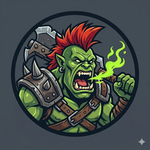

# WAAAGH！

这是个人 AI 分享的总目录。完全是个人级的理解，一切都是按寻思之力的加持。

# AI 工作流工具合集

## 第一层（最原始依赖关系）

### 基于 AI 的软件工程项目（持续迭代）

https://github.com/shelltdf/ai_rules_template

这是一个 cursor 的 rules 文件合集。主要目的是为了完成 AI 自动的软件工程管理模式。是后续所有项目都需要依赖的。已经被包含在后续项目中了，这里只是模板工程。

## 第二层（基础工具）

### UI 设计器 MCP（探索期）

https://github.com/shelltdf/uisvg_mcp

因为控制台程序已经有对应的代码和文本编辑器了，但是对于 GUI 开发没有一个跟 AI 紧密结合的精确描述用户意图的工具。这个 MCP 的目的是为了让 AI 和用户通过 svg 文件和编辑器所见即所得的进行沟通。

## 第三层（具体应用）

### 脑图 MCP（探索期）

https://github.com/shelltdf/mindmap_mcp

为了满足对脑图的沟通。

### 3D 模型 MCP（探索期）

https://github.com/shelltdf/viewer3d_mcp

为了满足对3D场景的沟通。

### Texture Atlas（探索期）

针对贴图拼版的需求。

https://github.com/shelltdf/texture_atlas_mcp

### 2D 精灵 MCP（探索期）

https://github.com/shelltdf/sprite2d_mcp

为了满足对 2D 精灵图的沟通。

### 2D 骨骼动画 MCP

为了满足对 2D 骨骼动画的沟通。

### 2D Tilemap MCP

为了满足对 2D Tilemap 的沟通。

### 编曲 MCP

为了满足对编曲的沟通。

### 音频处理 MCP

为了满足对音频处理的沟通。

### 视频处理 MCP

为了满足对视频处理的沟通。